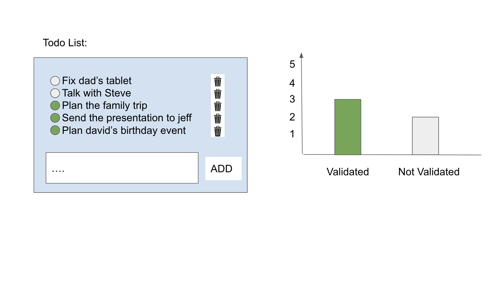

<p align="center">

  <h3 align="center">Test React</h3>

  <p align="center">
    <a href="https://app.ooti.co/api/v1/docs/">Swagger: Docs API</a>
    ·
    <a href="https://ooti.co/">ooti.co</a>
  </p>
</p>


<!-- TABLE OF CONTENTS -->
<details open="open">
  <summary>Table of Contents</summary>
  <ol>
    <li>
      <a href="#about-the-project">About The Project</a>
    </li>
    <li>
      <a href="#getting-started">Getting Started</a>
    </li>
    <li>
      <a href="#instructions">Instructions</a>
    </li>
    <li>
      <a href="#example">Example</a>
    </li>
  </ol>
</details>


<!-- ABOUT THE PROJECT -->
## About The Project

Create a TODO App in React


<!-- GETTING STARTED -->
## Getting Started

* React
  - https://reactjs.org/
* Initialize project
   ```sh
   npm install -g create-react-app
   npm init react-app my-app
   ```

<!-- Instructions -->
## Instructions
1) create react project
2) Create a todo list
3) Create chart with todo stats
4) Make a pull request with your code (include screenshot of home screen)

The goal is to:

* Add a action
* Validate a action
* Delete a action
* Have a histogram with two bars: one for the number of actions not validated, and one for the actions validated

## Example



